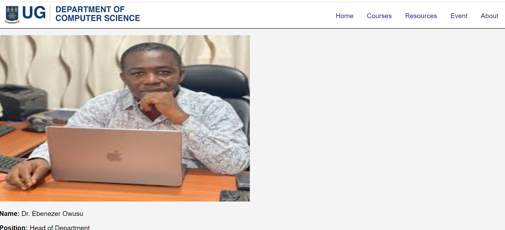

DCIT205_IA

INTRODUCTION

My name is Samuel Kyei Baffour Ansong a L200 student cloning a website for the University of Ghana(Computer Science Department) . For this site I used HTMl,CSS and JavaScript.
To be able to create a website you ought to be well equiped in your HTML,CSS,JavaScript and probably React.

DETAILED INSTRUCTIONS

Install Git:

Download and install Git from https://git-scm.com/.
Create a GitHub Account:

If you don't have a GitHub account, sign up at https://github.com/.
Step 1: Create a New Repository on GitHub
Log in to your GitHub account.

Click on the "+" sign in the top right corner of the page and select "New repository."

Fill in the repository name, add a description if you wish, and choose to initialize this repository with a README. Click "Create repository."

Step 2: Clone the Repository to Your Local Machine
Copy the repository URL from the green "Code" button on your repository page.

Open your terminal or command prompt.

Navigate to the directory where you want to clone the repository.

Run the following command, replacing <repository_url> with the URL you copied:

bash
Copy code
git clone <repository_url>
Step 3: Set Up Your Project Structure
Navigate into the newly cloned project:

bash
Copy code
cd <repository_name>
Create your project files:

Create an index.html file for your HTML content.
Create a style.css file for your CSS styles.
Create a script.js file for your JavaScript code.
Step 4: Add Content to Your Files
Edit your index.html, style.css, and script.js files to add the content, styles, and scripts for your project.

Step 5: Commit and Push Changes
Stage your changes:

 Name:Samuel  Kyei Ansong
 Student ID: 11093177

 

LESSONS FROM THIS WEBSITE

HTML is the  programming language used to create a website's basic foundation. This means learning the language can offer a comprehensive knowlefge of web pages' working and other essential concepts.
When  you come CSS ,it's the language responsible for giving exquisite design features to a website.